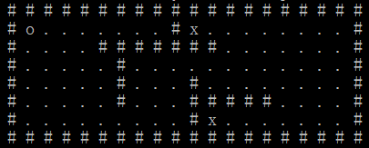

# Shortest Path
## Ideas

The maze can be abstracted as a 2D array or a doubly linked list. 

If we use doubly linked list for the maze, the benefit is that it is straightforward, and 
we can easily get nodes that it connects. The drawback is that we cannot visit a node by 
using it coordinates, since you need to traverse the whole list 
and do a bunch of IF statements to find the node you are looking for. And this way introduce complexity.

In this project, we adopt 2D array.

## Project Structure

### Class definition

<b> Program </b>

> Methods
- Main(): The entry of the program. We do the following steps here:
 - Initialize a instance of a class <i>Problem</i>, which abstracts the maze, reads condiguration from files, sets maze size and elements like the position of walls, agent and goals
 - Start the searching procedure by calling Search method of <i>Problem</i>  instance, and save the best solution into a file. 
 - Render the solution of the shortest path.

<b> State </b>

Using this class, we can easily extend our solution from BFS to heuristic-based methods, like A*.
> Properties
- Coord: an integer tuple (int, int) representing the coordination of an instance of <i>State<i> in the maze.
- Heu: a decimal storing the heuristic value of an instance of <i>State<i>.
- Parent: an instance of <i>State</i> linked the current instance to a parent node of a state.

<b> Problem </b>

> Properties
- _mapSize: (int, int) -> (length along Y axis, length along X axis). (5, 11) means 5 rows and 11 columns when rendering.
- _posAgent: (int, int)
- _goals: (int, int)[]. A list of coordinates represented as integer tuples.
- _walls: (int, int)[]. A list of coordinates represented as integer tuples.
- __symbols: a dictionary representing symbols in the maze for rending.
- queue: State[]. A queue of <i>State</i>. It stores the nodes which need to be explored.
- visitedStates: State[]. A list of <i>State</i>. It stores the nodes which have been explored.

> Methods
- GetCandidates: return a list of valid candidate states. Check validation of states here.
- IsValid: validate if a <i>State</i> is valid in a maze, check if it is out of the boundary of the maze, and if the state conflicts with other elements like walls.
- Search: start searching a solution, apply BFS, DFS, A*, etc. here.
- GetPath: return a list of state by a given state, usually the last node of the path.
- Render: render the maze with a given state.
- BFS:
- AStar:

## Project Structure

